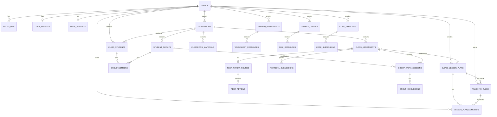
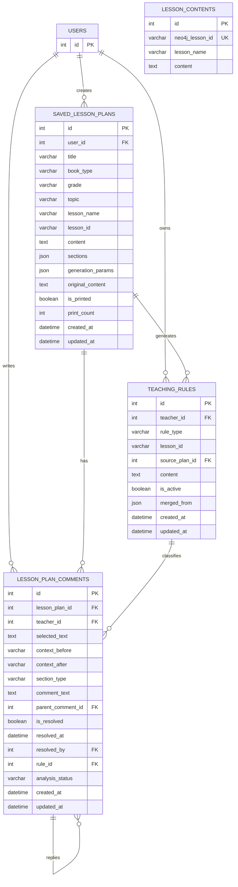
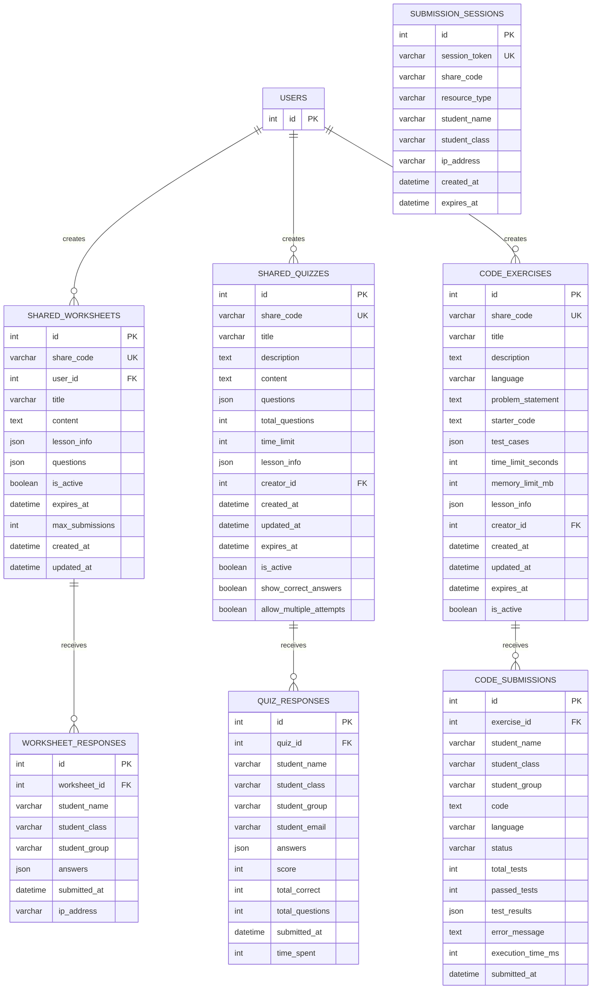
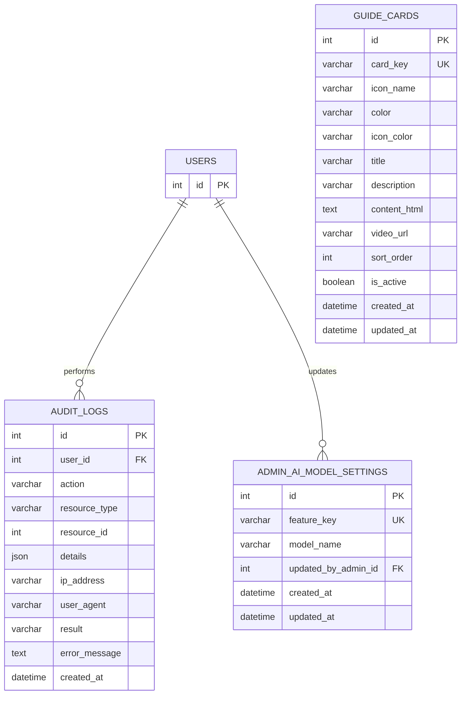

# Sơ đồ ERD — Hệ thống hỗ trợ giảng dạy

> Tổng số bảng: **35**. Đã loại các bảng không còn sử dụng: `chat_conversations`, `chat_messages` (tồn tại trong migration 005 nhưng không có model/API tham chiếu).
>
> Các sơ đồ dưới đây viết bằng Mermaid ERD. Render ra ảnh PNG/SVG đen-trắng bằng:
> - VS Code: extension *Markdown Preview Mermaid Support*
> - CLI: `mmdc -i ERD.md -o erd.png -t neutral -b white`
> - Web: https://mermaid.live/

---

## 1. Sơ đồ tổng quan (Overview)

Hiển thị các thực thể chính và quan hệ giữa các module. Chi tiết các cột xem ở sơ đồ con bên dưới.



---

## 2. Module Quản lý người dùng & Xác thực

```mermaid
erDiagram
    USERS {
        int id PK
        varchar email UK
        varchar password
        boolean is_active
        boolean is_verified
        int token_balance
        int tokens_used
        int failed_login_attempts
        datetime locked_until
        datetime created_at
    }
    ROLES {
        int id PK
        varchar name UK
        varchar description
    }
    PERMISSIONS {
        int id PK
        varchar name UK
        varchar description
    }
    USER_ROLES {
        int user_id PK_FK
        int role_id PK_FK
    }
    ROLE_PERMISSIONS {
        int role_id PK_FK
        int permission_id PK_FK
    }
    USER_PROFILES {
        int id PK
        int user_id FK_UK
        varchar first_name
        varchar last_name
        text bio
        varchar avatar_url
    }
    USER_SETTINGS {
        int id PK
        int user_id FK_UK
        varchar theme
        varchar language
        boolean marketing_emails_enabled
        boolean push_notifications_enabled
        varchar timezone
        json teaching_tools
        json custom_tools
        text teaching_style
        varchar school_name
        varchar department_name
        varchar teacher_name
    }
    EMAIL_VERIFICATION_TOKENS {
        int id PK
        varchar token UK
        int user_id FK
        datetime expires_at
        datetime created_at
        int attempts
    }
    PASSWORD_RESET_TOKENS {
        int id PK
        varchar token UK
        int user_id FK
        datetime expires_at
        datetime created_at
        int attempts
    }
    REFRESH_TOKENS {
        int id PK
        varchar token_hash UK
        int user_id FK
        datetime expires_at
        boolean revoked
        datetime created_at
    }

    USERS ||--o{ USER_ROLES : ""
    ROLES ||--o{ USER_ROLES : ""
    ROLES ||--o{ ROLE_PERMISSIONS : ""
    PERMISSIONS ||--o{ ROLE_PERMISSIONS : ""
    USERS ||--o| USER_PROFILES : ""
    USERS ||--o| USER_SETTINGS : ""
    USERS ||--o{ EMAIL_VERIFICATION_TOKENS : ""
    USERS ||--o{ PASSWORD_RESET_TOKENS : ""
    USERS ||--o{ REFRESH_TOKENS : ""
```

---

## 3. Module Soạn giáo án & Luật giảng dạy



---

## 4. Module Nội dung chia sẻ (Worksheet / Quiz / Code)



---

## 5. Module Lớp học & Phân công bài tập

```mermaid
erDiagram
    USERS {
        int id PK
    }
    CLASSROOMS {
        int id PK
        varchar name
        int teacher_id FK
        varchar grade
        varchar school_year
        text description
        datetime created_at
        datetime updated_at
    }
    CLASS_STUDENTS {
        int id PK
        int classroom_id FK
        int user_id FK
        varchar student_code
        int student_number
        varchar full_name
        date date_of_birth
        datetime joined_at
    }
    STUDENT_GROUPS {
        int id PK
        int classroom_id FK
        varchar name
        datetime created_at
    }
    GROUP_MEMBERS {
        int id PK
        int group_id FK
        int student_id FK
    }
    CLASS_ASSIGNMENTS {
        int id PK
        int classroom_id FK
        varchar content_type
        int content_id
        int lesson_plan_id FK
        json lesson_info
        varchar title
        text description
        varchar work_type
        boolean is_active
        datetime start_at
        datetime due_date
        boolean auto_peer_review
        varchar peer_review_status
        datetime peer_review_start_time
        datetime peer_review_end_time
        int peer_review_duration
        boolean chat_enabled
        datetime created_at
        datetime updated_at
    }
    CLASSROOM_MATERIALS {
        int id PK
        int classroom_id FK
        varchar content_type
        int content_id
        varchar title
        json lesson_info
        datetime created_at
    }
    SAVED_LESSON_PLANS {
        int id PK
    }

    USERS ||--o{ CLASSROOMS : teaches
    CLASSROOMS ||--o{ CLASS_STUDENTS : contains
    CLASSROOMS ||--o{ STUDENT_GROUPS : contains
    CLASSROOMS ||--o{ CLASS_ASSIGNMENTS : contains
    CLASSROOMS ||--o{ CLASSROOM_MATERIALS : contains
    USERS ||--o{ CLASS_STUDENTS : "is"
    CLASS_STUDENTS ||--o{ GROUP_MEMBERS : joins
    STUDENT_GROUPS ||--o{ GROUP_MEMBERS : has
    SAVED_LESSON_PLANS ||--o{ CLASS_ASSIGNMENTS : referenced_by
```



---

## 6. Module Làm bài nhóm & Đánh giá chéo

```mermaid
erDiagram
    USERS {
        int id PK
    }
    CLASS_ASSIGNMENTS {
        int id PK
    }
    STUDENT_GROUPS {
        int id PK
    }
    CLASS_STUDENTS {
        int id PK
    }
    GROUP_WORK_SESSIONS {
        int id PK
        int assignment_id FK
        int group_id FK
        varchar status
        json answers
        json task_assignments
        int leader_id FK
        json leader_votes
        json member_evaluations
        json member_grades
        float teacher_score
        text teacher_comment
        boolean chat_disabled
        datetime submitted_at
        datetime created_at
        datetime updated_at
    }
    INDIVIDUAL_SUBMISSIONS {
        int id PK
        int assignment_id FK
        int student_id FK
        json answers
        varchar status
        float teacher_score
        text teacher_comment
        datetime submitted_at
        datetime created_at
        datetime updated_at
    }
    GROUP_DISCUSSIONS {
        int id PK
        int work_session_id FK
        int user_id FK
        text message
        datetime created_at
    }
    PEER_REVIEW_ROUNDS {
        int id PK
        int assignment_id FK_UK
        varchar status
        json pairings
        datetime activated_at
        datetime completed_at
        datetime created_at
    }
    PEER_REVIEWS {
        int id PK
        int round_id FK
        int reviewer_id
        int reviewee_id
        varchar reviewer_type
        int reviewer_user_id FK
        json comments
        float score
        json member_scores
        json member_comments
        datetime submitted_at
        datetime created_at
    }

    CLASS_ASSIGNMENTS ||--o{ GROUP_WORK_SESSIONS : spawns
    CLASS_ASSIGNMENTS ||--o{ INDIVIDUAL_SUBMISSIONS : spawns
    CLASS_ASSIGNMENTS ||--o| PEER_REVIEW_ROUNDS : has
    STUDENT_GROUPS ||--o{ GROUP_WORK_SESSIONS : participates
    CLASS_STUDENTS ||--o{ INDIVIDUAL_SUBMISSIONS : submits
    CLASS_STUDENTS ||--o{ GROUP_WORK_SESSIONS : leads
    GROUP_WORK_SESSIONS ||--o{ GROUP_DISCUSSIONS : has
    USERS ||--o{ GROUP_DISCUSSIONS : posts
    PEER_REVIEW_ROUNDS ||--o{ PEER_REVIEWS : contains
    USERS ||--o{ PEER_REVIEWS : reviewer
```

---

## 7. Module Hệ thống (Audit / AI Settings / Guide)



---

## Ghi chú chú thích

- **PK**: Primary Key · **FK**: Foreign Key · **UK**: Unique Key · **PK_FK**: vừa là PK vừa là FK (bảng trung gian n-n)
- `||--o{` = 1 — nhiều · `||--o|` = 1 — 0..1 · `}o--o|` = nhiều — 0..1
- Tất cả FK tới `users.id` đều có `ON DELETE CASCADE` trừ: `audit_logs.user_id`, `admin_ai_model_settings.updated_by_admin_id`, `lesson_plan_comments.resolved_by`, `teaching_rules.source_plan_id`, `peer_reviews.reviewer_user_id` (đều `ON DELETE SET NULL`).
- `peer_reviews.reviewer_id` / `reviewee_id` là **soft FK** (không có constraint): tham chiếu tới `group_work_sessions.id` hoặc `individual_submissions.id` tuỳ `reviewer_type`.
- `class_assignments.content_id` và `classroom_materials.content_id` cũng là **soft FK**: tham chiếu `shared_worksheets` / `shared_quizzes` / `code_exercises` tuỳ `content_type`.
